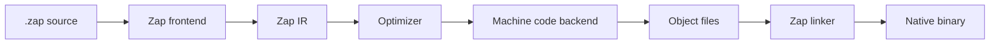

# Zap Native Bootstrap Plan

Zap must become a real native language, not a transpiler. This plan moves the project from an early prototype to a Go-style self-contained compiler.

## Goal

Build Zap so that:

- `zap build` creates native binaries.
- `zap run` does not require Node.js, JavaScript, Python, JVM, PHP, Go, Rust, or another app runtime.
- `zap test`, `zap fmt`, `zap doc`, and `zap install` are part of the official toolchain.
- Zap eventually compiles its own compiler.

## Non-Goals

- Zap is not a JavaScript framework.
- Zap is not a TypeScript-to-JavaScript transpiler.
- Zap is not a language that runs on Node.js, JVM, Python, PHP, or Go.
- Zap is not a wrapper around another language's package manager.

## Architecture



## Bootstrap Stages

### Stage 1: Specification Lock

- freeze syntax for variables, functions, structs, modules, packages, and errors
- define the grammar in EBNF
- define tokens and AST nodes
- define the first standard library subset
- define object file and executable targets

### Stage 2: Minimal Native Compiler

Build a tiny compiler named `zap0` with no external runtime dependency. It must support:

- lexical scanning
- recursive descent parser
- AST
- simple type checker
- integer, bool, string literals
- `fn main`
- local variables
- `if`
- `while`
- function calls
- direct native code generation for one target first, preferably `aarch64-macos` or `x86_64-linux`

First milestone:

```zap
fn main() -> Int {
  print("Hello from native Zap")
  return 0
}
```

### Stage 3: Object Files and Linker

- emit object files directly
- link with Zap's minimal runtime
- support static binaries where practical
- add debug symbols
- add cross-compilation target triples

### Stage 4: Zap Runtime

Implement runtime pieces in Zap's own low-level subset:

- memory allocator
- strings
- slices/lists
- maps
- panic handling
- file descriptors
- process exit
- clock and timers
- async scheduler foundation

### Stage 5: Package System

- `zap.package`
- `zap.lock`
- package import graph
- module cache
- semantic versioning
- checksum verification
- `zap install`

### Stage 6: Self-Hosting

Rewrite the compiler frontend in Zap:

- lexer in Zap
- parser in Zap
- AST in Zap
- semantic analyzer in Zap
- ZIR builder in Zap

Then use:

```bash
zap0 build compiler/zapc.zap -o zap1
zap1 build compiler/zapc.zap -o zap2
```

`zap1` and `zap2` must produce equivalent compiler behavior.

### Stage 7: Go-Like Developer Experience

- one binary toolchain
- fast compiler
- standard formatter
- built-in test runner
- built-in docs
- package registry
- simple workspaces
- stable compatibility policy

## First Native Subset

The first real Zap compiler should intentionally be small:

```zap
package main

fn add(a: Int, b: Int) -> Int {
  return a + b
}

fn main() -> Int {
  let result = add(20, 22)
  print(result)
  return 0
}
```

Supported in v0 native:

- `package`
- `use`
- `fn`
- `let`
- `const`
- `return`
- `if`
- `else`
- `while`
- `Int`
- `Bool`
- `String`
- native `print`

Deferred until later:

- classes
- async
- web framework
- desktop framework
- advanced generics
- pattern matching
- ORM

## Repository Direction

Recommended future structure:

```text
compiler/
  zap0/
    scanner.zap
    parser.zap
    ast.zap
    typecheck.zap
    codegen.zap
  runtime/
    alloc.zap
    string.zap
    process.zap
  linker/
    elf.zap
    macho.zap
    pe.zap
std/
  core/
  fs/
  net/
  http/
cmd/
  zap/
tests/
examples/
docs/
```

The existing TypeScript prototype should be treated as disposable research. The long-term product should be native Zap compiling native Zap.
