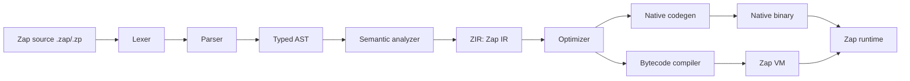
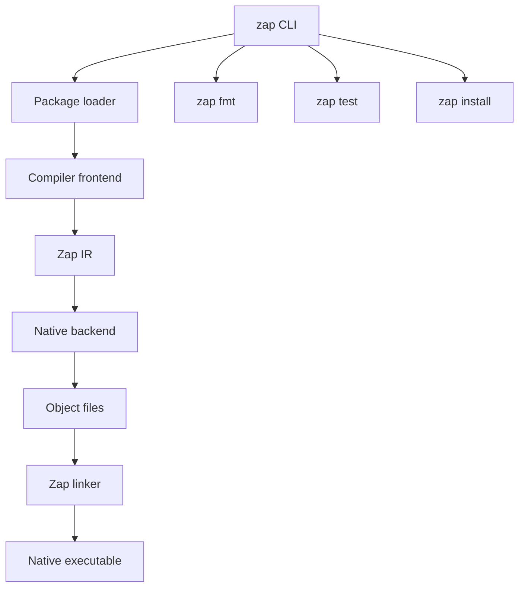
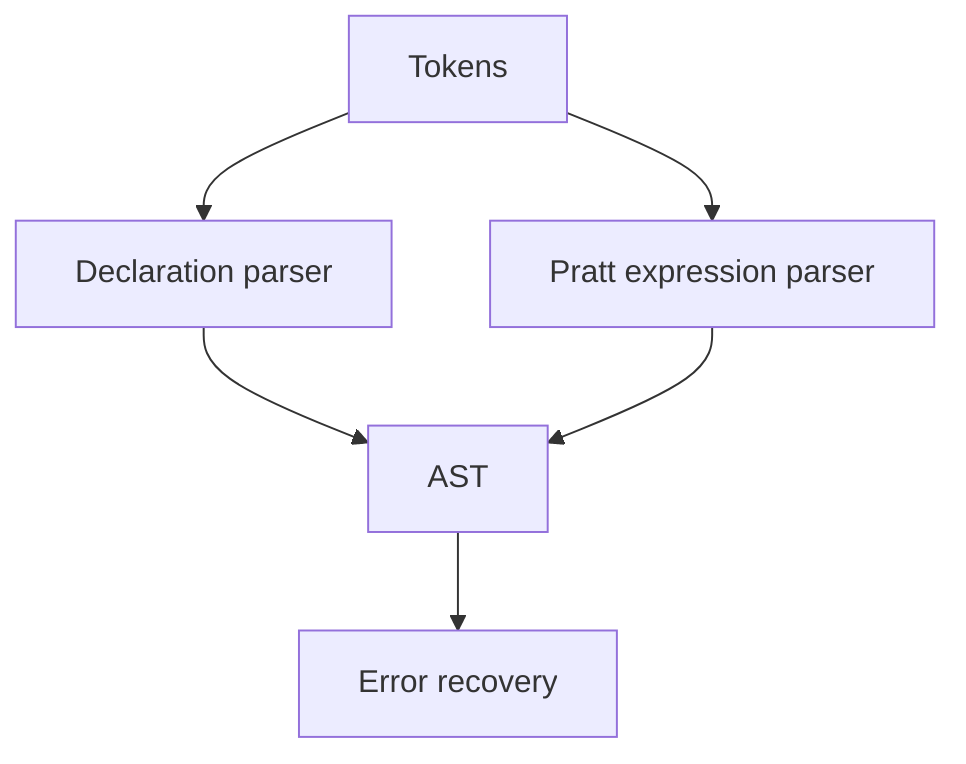
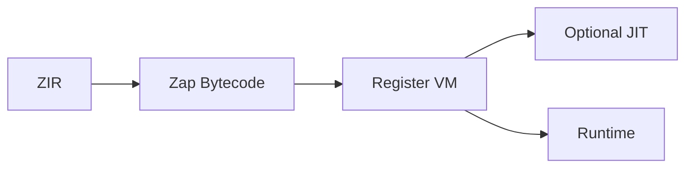
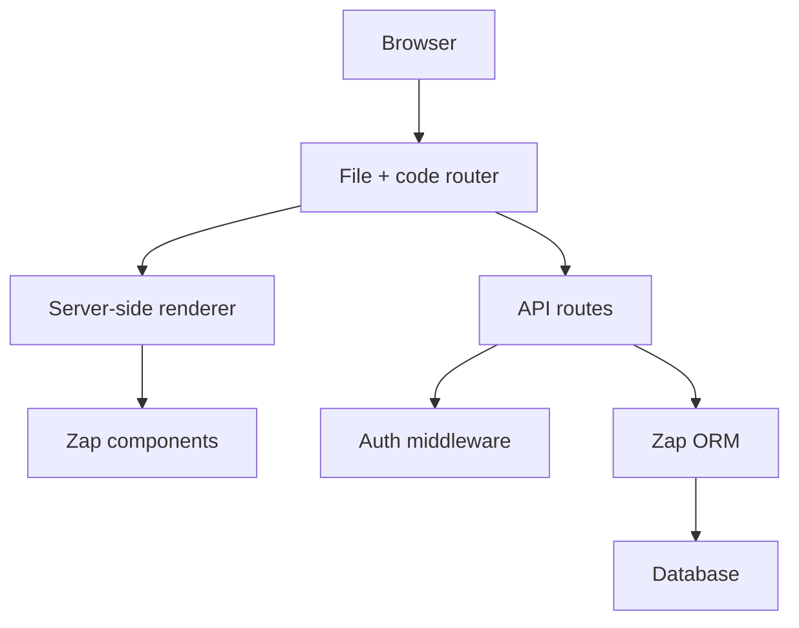
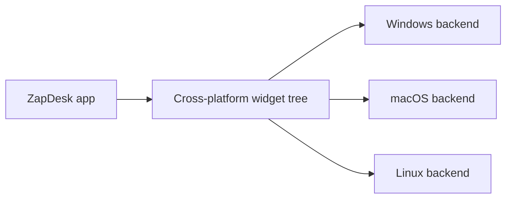

# Zap Programming Language Specification

Version: 0.1 architecture draft  
Status: design specification  
Owner: MurphTech Software Solutions  
File extensions: `.zap`, `.zp`

## 1. Vision

Zap is a native, general-purpose programming language designed for full-stack product development: web apps, desktop apps, backend services, CLIs, and high-performance native binaries. Zap is not defined as a wrapper around JavaScript, Python, Go, Java, PHP, Rust, or any other host language. A production Zap toolchain has its own lexer, parser, semantic analyzer, IR, optimizer, runtime, package manager, standard library, linker, and native code generator.

Zap follows the same product philosophy that made Go successful: one official toolchain, fast builds, simple commands, standard formatting, easy deployment, built-in testing, practical concurrency, and small native binaries. Zap should feel like a single coherent system, not a collection of third-party build tools glued together.

The current repository may contain early prototype code in another language while Zap is being bootstrapped. That prototype is not the Zap runtime model. The production goal is a self-hosted Zap compiler where Zap source compiles Zap itself.

Zap is designed around four principles:

- **Beginner clarity:** readable syntax, strong defaults, useful diagnostics.
- **Native performance:** ahead-of-time compilation to platform binaries.
- **Full-stack reach:** web, APIs, desktop, CLI, database, and cloud tooling.
- **Enterprise strength:** modules, packages, typed APIs, async, concurrency, generics, interfaces, testing, documentation, and stable builds.

## 2. System Overview



## 2.1 Go-Style Native Toolchain

Zap ships as one command: `zap`.

```text
zap command
  lexer
  parser
  type checker
  package loader
  optimizer
  native compiler
  linker
  test runner
  formatter
  package manager
  documentation generator
```

Design rules:

- `zap build` produces a native executable by default.
- `zap run` compiles and runs without requiring an external runtime.
- `zap test` discovers tests from packages.
- `zap fmt` is the official formatter, with no style debates.
- `zap mod` and `zap install` manage modules and dependencies.
- Cross-compilation is built in through `--target`.
- The standard library is versioned with the compiler.
- The compiler can be built from source without Node, npm, Python, Java, or a VM runtime.



## 3. Language Design

### 3.1 Source File

```zap
package app.web

use zap.http.{Request, Response}
use app.auth.User

pub fn main() -> Int {
  print("Zap is ready")
  return 0
}
```

### 3.2 Comments

```zap
// Single-line comment

/*
  Multi-line comment
*/
```

### 3.3 Values, Variables, and Constants

Zap uses `let` for mutable bindings and `const` for immutable bindings.

```zap
let count: Int = 1
count = count + 1

const appName = "ZapDesk"
const pi: Float64 = 3.141592
```

Type inference is local and explicit at public API boundaries.

```zap
let city = "Mumbai"      // String
let active = true        // Bool
let users = List<User>() // List<User>
```

### 3.4 Primitive Types

- `Bool`
- `Int`, `Int8`, `Int16`, `Int32`, `Int64`
- `UInt`, `UInt8`, `UInt16`, `UInt32`, `UInt64`
- `Float32`, `Float64`
- `Char`
- `String`
- `Bytes`
- `Void`
- `Never`

### 3.5 Functions

```zap
fn add(a: Int, b: Int) -> Int {
  return a + b
}

fn greet(name: String = "World") -> String {
  return "Hello, {name}!"
}

pub fn main() {
  print(greet())
}
```

Functions are first-class values:

```zap
let mapper: fn(Int) -> Int = fn(x: Int) -> Int {
  return x * 2
}
```

### 3.6 Structs

Structs are value-oriented data models.

```zap
struct Point {
  x: Float64
  y: Float64
}

let origin = Point { x: 0.0, y: 0.0 }
```

### 3.7 Classes

Classes are reference-oriented models with identity and encapsulation.

```zap
class Account {
  pub id: String
  private balance: Money

  init(id: String, opening: Money) {
    self.id = id
    self.balance = opening
  }

  pub fn deposit(amount: Money) -> Result<Money, AccountError> {
    guard amount > Money.zero else {
      return err(AccountError.InvalidAmount)
    }

    self.balance = self.balance + amount
    return ok(self.balance)
  }
}
```

### 3.8 Interfaces

Interfaces define behavior contracts.

```zap
interface Repository<T> {
  fn find(id: String) -> Result<T, DbError>
  fn save(value: T) -> Result<T, DbError>
}

class UserRepo : Repository<User> {
  fn find(id: String) -> Result<User, DbError> {
    return db.table("users").find(id)
  }
}
```

### 3.9 Enums and Pattern Matching

```zap
enum PaymentState {
  Pending
  Paid(receipt: String)
  Failed(reason: String)
}

fn label(state: PaymentState) -> String {
  match state {
    Pending => "Waiting"
    Paid(receipt) => "Paid: {receipt}"
    Failed(reason) if reason.len > 0 => "Failed: {reason}"
    Failed(_) => "Failed"
  }
}
```

Pattern matching is exhaustive for enums unless a wildcard branch is present.

### 3.10 Error Handling

Zap has typed errors through `Result<T, E>` and shorthand propagation with `?`.

```zap
fn loadUser(id: String) -> Result<User, AppError> {
  const row = db.table("users").find(id)?
  return ok(User.from(row))
}

fn handler(req: Request) -> Response {
  try {
    const user = loadUser(req.param("id"))?
    return json(user)
  } catch AppError.NotFound {
    return status(404).json({ message: "User not found" })
  } catch error {
    return status(500).json({ message: error.message })
  }
}
```

`panic` exists only for unrecoverable programmer errors.

### 3.11 Generics

```zap
struct Box<T> {
  value: T
}

fn first<T>(items: List<T>) -> Option<T> {
  if items.isEmpty {
    return none
  }
  return some(items[0])
}

fn sort<T: Comparable>(items: List<T>) -> List<T> {
  // ...
}
```

Generics are monomorphized in optimized native builds and can use reified metadata in VM builds.

### 3.12 Async Programming

```zap
async fn fetchUser(id: String) -> Result<User, HttpError> {
  const response = await http.get("https://api.example.com/users/{id}")
  return response.json<User>()
}

async fn page() -> Html {
  const user = await fetchUser("42")?
  return <UserCard user={user} />
}
```

Zap uses structured concurrency. Tasks belong to a scope and are cancelled when the scope exits unless detached explicitly.

```zap
async fn loadDashboard() -> Dashboard {
  async scope {
    let userTask = task fetchUser()
    let salesTask = task fetchSales()

    return Dashboard {
      user: await userTask,
      sales: await salesTask
    }
  }
}
```

### 3.13 Memory Management

Zap uses **region-aware automatic reference management**:

- Values default to stack or region allocation.
- Classes and closures use reference-counted heap allocation.
- Cycles are prevented through `weak` references or collected by a low-frequency cycle detector.
- The compiler performs escape analysis and stack promotion.
- Native resources implement deterministic `dispose`.
- Long-running servers use arenas for request-scoped allocations.

```zap
using file = fs.open("report.txt")?
file.write("Generated by Zap")
```

`using` guarantees deterministic cleanup.

### 3.14 Type System

Zap is statically typed with:

- Local type inference
- Nominal classes and interfaces
- Structural records for literals
- Sum types through enums
- Nullable values represented as `Option<T>`, not implicit null
- Generic constraints
- Effect-aware async functions
- Visibility modifiers: `pub`, `package`, `private`

## 4. Modules and Packages

```zap
package commerce.orders

use zap.time.DateTime
use commerce.users.User

pub struct Order {
  id: String
  createdAt: DateTime
}
```

Package manifest:

```zap
package "shop"
version "1.0.0"

target native

dependencies {
  zap.db = ">=0.8 <1.0"
  authkit = "^2.1.0"
}
```

## 5. Compiler Architecture

### 5.1 Lexer

The lexer converts source text into tokens:

- identifiers
- keywords
- literals
- operators
- punctuation
- indentation-neutral braces
- trivia for formatter and diagnostics

### 5.2 Parser

The parser uses Pratt parsing for expressions and recursive descent for declarations.



### 5.3 AST Structure

Core AST nodes:

- `PackageDecl`
- `UseDecl`
- `FnDecl`
- `StructDecl`
- `ClassDecl`
- `InterfaceDecl`
- `EnumDecl`
- `BlockStmt`
- `IfStmt`
- `MatchExpr`
- `CallExpr`
- `MemberExpr`
- `GenericType`
- `ResultType`
- `ComponentDecl`

### 5.4 Semantic Analyzer

Semantic passes:

1. Package graph resolution
2. Symbol table construction
3. Type inference and checking
4. Interface conformance
5. Borrow, lifetime, and escape analysis
6. Exhaustiveness checking
7. Async effect validation
8. Access control validation
9. Definite assignment
10. Diagnostic suggestions

### 5.5 Intermediate Representation

Zap IR, called **ZIR**, is a typed SSA-based representation.

```zir
fn @add(%a: i64, %b: i64) -> i64 {
entry:
  %0 = add.i64 %a, %b
  ret %0
}
```

ZIR supports:

- typed SSA values
- ownership and lifetime markers
- async suspension points
- exception-free result propagation
- generic specialization
- debug metadata

### 5.6 Optimizer

Optimization pipeline:

- constant folding
- dead code elimination
- inlining
- escape analysis
- stack promotion
- bounds-check elimination
- enum layout optimization
- specialization of generics
- async state-machine lowering
- loop vectorization
- link-time optimization

### 5.7 Native Code Generation

Zap supports two implementation strategies:

- **MVP:** emit C-compatible object code through a small Zap backend.
- **Production:** direct machine-code backend for x86_64 and ARM64, with optional LLVM integration for portability.

Targets:

- `x86_64-linux`
- `aarch64-linux`
- `x86_64-windows`
- `aarch64-windows`
- `x86_64-macos`
- `aarch64-macos`

### 5.8 Bytecode VM Option

The VM is optional for:

- fast development mode
- scripting
- plugin systems
- serverless cold starts
- education



## 6. Runtime Design

Zap runtime components:

- allocator and arenas
- reference counting
- cycle detection
- async scheduler
- event loop
- timers
- task cancellation
- filesystem bindings
- networking stack
- TLS
- process API
- database drivers
- reflection metadata for debug and ORM

### 6.1 Concurrency Model

Zap uses lightweight tasks over a work-stealing scheduler.

```zap
async scope {
  let a = task computeA()
  let b = task computeB()
  print(await a + await b)
}
```

For CPU-bound work:

```zap
parallel for image in images {
  resize(image)
}
```

### 6.2 File System API

```zap
const text = fs.readText("README.md")?
fs.writeText("dist/output.txt", text.upper())?

for entry in fs.walk("src") {
  print(entry.path)
}
```

### 6.3 Networking API

```zap
const response = await http.get("https://example.com/api")
const data = response.json<Map<String, String>>()?
```

### 6.4 Database API

```zap
const db = database.connect(env("DATABASE_URL"))?

const users = await db.table("users")
  .where("active", true)
  .orderBy("created_at", desc)
  .all<User>()
```

## 7. Package Manager

`zap install` resolves dependencies from `zap.package` and writes `zap.lock`.

Commands:

```bash
zap install
zap install zap.db
zap install authkit@^2.0
zap update
zap publish
zap audit
```

Dependency rules:

- semantic versioning
- lockfile-based reproducible builds
- private registry support
- checksum verification
- signed packages
- workspace monorepos

## 8. Standard Library

Core namespaces:

- `zap.core`
- `zap.collections`
- `zap.fs`
- `zap.path`
- `zap.http`
- `zap.net`
- `zap.json`
- `zap.xml`
- `zap.crypto`
- `zap.db`
- `zap.time`
- `zap.process`
- `zap.test`
- `zap.web`
- `zap.desktop`
- `zap.cli`

## 9. Zap Web Framework

Zap includes a native full-stack framework called **ZapWeb**.



### 9.1 Routing

File routes:

```text
/src/pages/index.zap
/src/pages/users/[id].zap
/src/api/users.zap
```

Code routes:

```zap
route get "/users/{id}" -> userShow
route post "/api/users" -> createUser
```

### 9.2 Components

Zap components are typed functions returning `Html`.

```zap
component Button(label: String, kind: ButtonKind = .Primary) -> Html {
  return <button class="btn {kind.className}">{label}</button>
}
```

### 9.3 State Management

```zap
store CounterStore {
  state count: Int = 0

  action inc() {
    count = count + 1
  }
}
```

### 9.4 SSR and Hydration

```zap
page "/" {
  async fn load() -> HomeData {
    return HomeData {
      products: await Product.all()
    }
  }

  component render(data: HomeData) -> Html {
    return <ProductGrid products={data.products} />
  }
}
```

### 9.5 API Routes

```zap
api get "/api/status" {
  return json({ status: "ok", runtime: zap.version })
}

api post "/api/users" {
  const input = request.json<CreateUser>()?
  const user = await User.create(input)
  return status(201).json(user)
}
```

### 9.6 Authentication

```zap
auth {
  provider emailPassword
  session cookie {
    name: "zap_session"
    secure: true
  }
}

middleware requireUser(req: Request) -> Result<User, AuthError> {
  return auth.currentUser(req)
}
```

### 9.7 ORM

```zap
model User {
  id: Uuid @primary
  name: String
  email: String @unique
  createdAt: DateTime @default(now)

  hasMany posts: Post
}

const user = await User.where(.email == "hello@example.com").first()
```

## 10. Zap Desktop Framework

Zap includes a native GUI toolkit called **ZapDesk**.

Targets:

- Windows: WinUI/native controls
- macOS: AppKit/SwiftUI-compatible native controls through Zap ABI bindings
- Linux: GTK/libadwaita native controls



### 10.1 Desktop Example

```zap
use zap.desktop.*

app "TodoDesk" {
  window title: "Todos", width: 900, height: 640 {
    menu {
      item "File/New" -> newTodo
      item "File/Quit" -> app.quit
    }

    column spacing: 12 {
      text("My Tasks").font(size: 24, weight: .Bold)
      form {
        input bind: todoTitle, placeholder: "Task title"
        button "Add" -> addTodo
      }
      table items: todos {
        column "Title" -> item.title
        column "Done" -> checkbox(bind: item.done)
      }
    }
  }
}
```

Supported controls:

- windows
- buttons
- forms
- text inputs
- tables
- menus
- toolbars
- native dialogs
- file pickers
- notifications
- web views

## 11. Project Structure

```text
my-zap-app/
  src/
    main.zap
    components/
      Button.zap
    pages/
      index.zap
      users/
        [id].zap
    api/
      users.zap
    models/
      User.zap
    desktop/
      app.zap
  public/
    logo.svg
  tests/
    user_test.zap
  zap.config
  zap.package
  zap.lock
```

## 12. CLI Commands

```bash
zap new project my-app
zap dev
zap build
zap build --target aarch64-macos
zap run src/main.zap
zap test
zap fmt
zap lint
zap install
zap install zap.db
zap publish
zap doc
zap repl
zap desktop dev
zap desktop build
zap web deploy
```

## 13. Developer Experience

### 13.1 VS Code Extension

Features:

- syntax highlighting
- semantic tokens
- diagnostics
- autocomplete
- hover documentation
- go to definition
- rename symbol
- code actions
- formatter integration
- debugger launch profiles
- file icons for `.zap` and `.zp`

### 13.2 Formatter

```bash
zap fmt
zap fmt src/
```

Formatter rules:

- two-space indentation
- braces on same line
- stable import sorting
- max line width: 100
- trailing commas in multiline literals

### 13.3 Linter

```bash
zap lint
zap lint --fix
```

Lint categories:

- correctness
- performance
- security
- style
- API compatibility
- database migration safety

### 13.4 Debugger

The Zap debugger supports:

- breakpoints
- watch expressions
- async task inspection
- memory allocation views
- stack traces
- source maps for generated web output
- time-travel snapshots in VM mode

### 13.5 Documentation Generator

```bash
zap doc
zap doc --serve
```

Generates package docs from public declarations, examples, markdown guides, and type metadata.

## 14. Complete Code Examples

### 14.1 Hello World

```zap
pub fn main() {
  print("Hello from Zap!")
}
```

### 14.2 Variables

```zap
pub fn main() {
  let name = "Mukesh"
  let score: Int = 100
  const product = "Zap"

  print("{name} is building {product} with score {score}")
}
```

### 14.3 Functions

```zap
fn multiply(a: Int, b: Int) -> Int {
  return a * b
}

pub fn main() {
  print(multiply(6, 7))
}
```

### 14.4 Classes

```zap
class User {
  pub id: String
  pub name: String

  init(id: String, name: String) {
    self.id = id
    self.name = name
  }

  pub fn displayName() -> String {
    return self.name
  }
}

pub fn main() {
  const user = User("1", "Mukesh")
  print(user.displayName())
}
```

### 14.5 REST API

```zap
use zap.http.*

api get "/api/status" {
  return json({
    status: "ok",
    language: "Zap"
  })
}

api post "/api/messages" {
  const body = request.json<CreateMessage>()?
  const saved = await Message.create(body)
  return status(201).json(saved)
}
```

### 14.6 Database Connection

```zap
use zap.db.*

pub async fn main() -> Result<Void, DbError> {
  const db = database.connect(env("DATABASE_URL"))?

  const users = await db.table("users")
    .where("active", true)
    .all<User>()

  for user in users {
    print(user.email)
  }

  return ok()
}
```

### 14.7 Web Application

```zap
use zap.web.*

model Todo {
  id: Uuid @primary
  title: String
  done: Bool @default(false)
}

page "/" {
  async fn load() -> List<Todo> {
    return await Todo.orderBy(.createdAt, desc).all()
  }

  component render(todos: List<Todo>) -> Html {
    return <main>
      <h1>Zap Todos</h1>
      <TodoForm />
      <ul>
        {for todo in todos {
          <li class={todo.done ? "done" : ""}>{todo.title}</li>
        }}
      </ul>
    </main>
  }
}

api post "/api/todos" {
  const input = request.json<CreateTodo>()?
  return status(201).json(await Todo.create(input))
}
```

### 14.8 Desktop Application

```zap
use zap.desktop.*

app "Zap Notes" {
  state notes: List<Note> = []
  state title: String = ""

  fn addNote() {
    notes.push(Note { title })
    title = ""
  }

  window title: "Zap Notes", width: 760, height: 540 {
    menu {
      item "File/New Note" -> addNote
      item "File/Quit" -> app.quit
    }

    column spacing: 10 {
      form {
        input bind: title, placeholder: "New note"
        button "Add" -> addNote
      }

      table items: notes {
        column "Title" -> item.title
      }
    }
  }
}
```

## 15. Editor Icon Kit

The repository includes SVG assets for editor integrations:

- `assets/icons/zap-logo.svg`
- `assets/icons/zap-file-icon.svg`
- `assets/icons/zap-file-icon-dark.svg`
- `assets/icons/zap-file-icon-light.svg`
- `editor/zap-icon-theme.json`

Recommended file associations:

```json
{
  "files.associations": {
    "*.zap": "zap",
    "*.zp": "zap"
  }
}
```

## 16. Roadmap

### Phase 0: Research and Language Lock

- finalize grammar
- write formal syntax reference
- define type system
- define standard diagnostics
- build sample applications
- publish language RFC process

### Phase 1: MVP Compiler

- native lexer
- parser
- AST
- interpreter or VM
- variables, functions, conditionals, loops
- modules
- tests
- formatter MVP

### Phase 2: Static Typing and Packages

- semantic analyzer
- type inference
- structs, enums, classes, interfaces
- package manifest
- `zap install`
- lockfile
- registry prototype

### Phase 3: Native Backend

- ZIR
- optimizer MVP
- object file emission
- platform linker integration
- memory runtime
- debugger symbols
- `zap build`

### Phase 4: Async Runtime and Standard Library

- event loop
- task scheduler
- filesystem
- networking
- HTTP server/client
- JSON
- crypto
- process API
- test runner

### Phase 5: ZapWeb

- routing
- components
- SSR
- hydration
- API routes
- auth
- ORM
- migrations
- deployment adapters

### Phase 6: ZapDesk

- cross-platform widget tree
- Windows backend
- macOS backend
- Linux backend
- menus, dialogs, tables, forms
- packaging and signing

### Phase 7: Tooling

- VS Code extension
- language server
- formatter stable
- linter stable
- debugger
- docs generator
- CI integrations

### Phase 8: Production Readiness

- security audits
- package signing
- compatibility policy
- performance benchmarks
- standard library stabilization
- migration tooling
- long-term support releases

### Phase 9: Ecosystem Growth

- official tutorials
- package registry launch
- framework templates
- cloud hosting partnerships
- enterprise support
- certification program
- community governance

### Phase 10: Million-Developer Scale

- stable 1.0
- multi-year compatibility guarantees
- extensive package ecosystem
- official IDE integrations
- native mobile exploration
- global conferences and training
